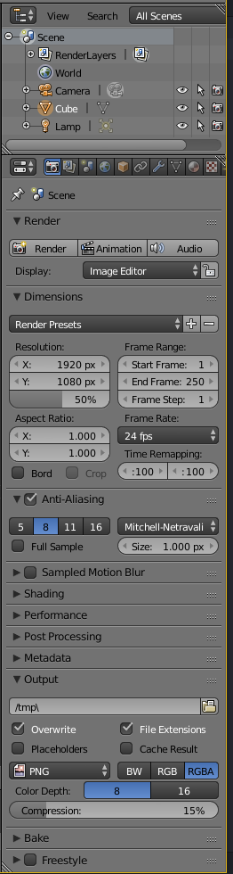

# Navigation

## Konfiguration

File - User Preferences  

Einstellen von Shortcuts, Themes, Mausklick rechts / links tauschen.

## Properties Panel

Wird zum Bearbeiten des aktuellen Objekts verwendet.

Im oberen Bereich ist der sogenannte Outliner sichtbar, hier können Objekte selektiert werden.

## Shortcuts

* Shift + C: Zurücksetzen des Cursors auf 0,0,0
* Objekt auswählen + .: An Objekt einrasten
* Numpad: Sichtpunkt auswählen
* Shift + A: Spawn-Menü
* Shift + D: Duplizieren
* Space: Suchmenü

## Maus

* Scrollen: Zoomen
* Mausrad gedrückt halten: Rotation um pivot point.
* Shift + Mausrad gedrückt halten: Bewegung.

## Elemente bewegen

Mit den Pfeilen können Objekte auf der jeweiligen Achse bewegt werden.

* g: grab, freies Bewegen von Objekten mit der Maus. Zusätzlich kann x,y, oder z gedrückt werden, um die Bewegung auf eine Achse zu beschränken. Abschließend linksklick zum Bestätigen, Rechtsklick zum Zurücksetzen.
* r: rotate, freies drehen, auch hier x,y,z möglich
* s: scale, freies skalieren, auch hier x,y,z möglich
