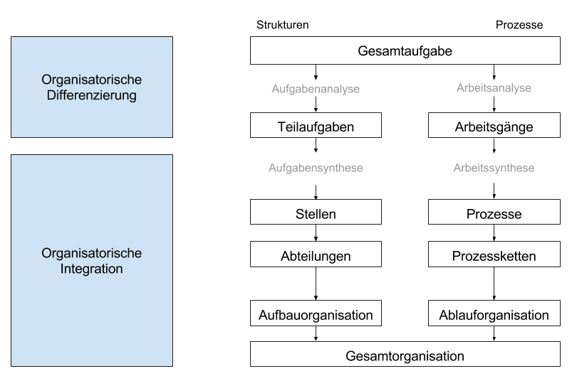

# Identifikation und Organisation von Geschäftsprozessen

## Ansätze zur Identifikation

### Top-Down

* Kunden und Geschäftsziele bilden in der Regel die Ausgangsbasis.
* Ergebnisse sind strategiekonform und überschneidungsfrei
* Redundanzen, Überschneidungen und Aktivitäten ohne Kundennutzen werden aufgedeckt
* **Vorteil:** Geringe Gefahr, sich im Detail zu verlieren

### Bottom-Up

* Basis sind Aktivitäten auf unterster Prozessebene
* Analyse nach ablauf- und informationstechnischen Gesichtspunkten
* Bündelung zu Arbeitsschritten, Prozessschritten, Teil- und Geschäftsprozessen

## Prozessdarstellung - Detaillierungsgrade

| Grad | Ebene              | Inhalte                                                                                |
|------|--------------------|----------------------------------------------------------------------------------------|
| 1    | Prozesslandkarte   | Einzelne Prozesse, beteiligte Organisationseinheiten, wesentliche Leistungsbeziehungen |
| 2    | Geschäftsprozesse  | Übergeordnete Teilprozesse, ausführende Organisationseinheiten, Verknüpfung zwischen Teilprozessen |
| 3    | Teilprozesse       | Einzelne Verarbeitungsvorgänge, Start- und Endpunkt, Input und Output, ausführende Teams oder Stellen, Prozessvarianten und Verzweigungen |
| 4    | Technische Details | Zusätzliche Detailinformationen: Bearbeitungsaufwand, Materialeinsatz, Informationsfluss, Menüzugriffe, eingesetzte Maschinen, Hilfsmittel, Hard- und Softwarefehlerquellen, Risiken, statistische Verteilung der Prozessvarianten |

## Einsatz von Prozessmodellen

Organisatorisch:

* Dokumentation gegenwärtiger und angestrebter Prozesse
* Prozessbenchmarking
* Unterstützung von Outsourcing- und Insourcing-Entscheidungen

Gestaltung von IT-Systemen:

* Dokumentation der Systemanforderungen (Pflichtenheft)
* Customizing integrierter Standardsoftware
* Spezifikation von Workflows
* Erstellung von Simulationsmodellen

## Prozesslandkarte

Die Prozesslandkarte verschafft einen Überblick über die Geschäftsprozesse eines Unternehmens.

* Beschränkung auf die wesentlichen Leistungsbeziehungen
* Darstellung der Prozesse ohne Details
* Optionale Darstellung beteiligter Organisationseinheiten

Nutzenaspekte:

* Steuerung (geringer Nutzen)
* Optimierung (mittlerer Nutzen)
* Information und Transparenz (hoher Nutzen)

## Magisches Dreieck der Prozessgestaltung

Zeit - Kosten - Qualität

| Zeit | Kosten | Qualität |
|------|--------|----------|
| <ul><li>time-to-market minimieren</li><li>Bearbeitungszeiten minimieren</li><li>Transportzeiten minimieren</li><li>Liegezeiten minimieren</li><li>Anteil nicht-wertschöpfender Zeiten minimieren</li></ul> | <ul><li>Herstellkosten minimieren</li><li>Prozesskosten minimieren</li><li>Fixkosten minimieren</li><li>Gemeinkosten minimieren</li></ul> | <ul><li>Fehlerrate minimieren</li><li>Anzahl an Korrekturen minimieren</li><li>Termintreue maximieren</li><li>Prozessstabilität maximieren</li><li>Erreichbarkeit maximieren</li><li>Beratungsqualität maximieren</li></ul>

## Organisatorische Gestaltungsregeln

* Geschäftsprozesse beginnen und enden beim Kunden
* Jeder Geschäftsprozess ist in Teilprozesse, Prozess- und Arbeitsschritte zu unterteilen (Aufbaustruktur)
* In Geschäftsprozessen werden Geschäftsfälle komplett bearbeitet
* Für jeden Geschäftsprozess ist eine zeit- und ressourcengünstige Ablaufstruktur festzulegen
* Nicht wertschöpfende Teilprozesse, Prozess- und Arbeitsschritte sind zu vernachlässigen
* Mit den Lieferanten der Geschäftsprozesse sind Leistungsvereinbarungen (SLAs) zu treffen
* Geschäftsprozesse sind zu dokumentieren und zu gewichten
* Jeder Geschäftsprozess hat einen Verantwortlichen
* Geschäftsprozesse sind in die Unternehmensorganisation zu integrieren

## Prozessleistungskategorien

| Kategorie       | Anteil  | Beschreibung |
|-----------------|---------|--------------|
| Nutzleistung    | 25%     | <ul><li>Trägt direkt zur Wertsteigerung bei</li><li>Leistungen, die Kundenanforderungen erfüllen</li></ul> |
| Stützleistung   | 45%     | <ul><li>Trägt indirekt zur Wertsteigerung bei</li><li>Leistungen, die nicht direkt in Produkte einfließen</li></ul> |
| Blindleistung   | 20%     | <ul><li>Trägt nicht zur Wertsteigerung bei</li><li>Erfüllt keinen Zweck bei der Erfüllung der Kundenanforderungen</li><li>Lediglich Kosten</li></ul> |
| Fehlleistung    | 10%     | <ul><li>Trägt zur Wertminderung bei</li><li>Leistungen, die bei der Erfüllung von Kundenanforderungen entgegenwirken</li></ul> |

Ziel des Geschäftsprozessmanagements ist es, Fehl- und Blindleistung zu beseitigen, Stützleistungen auf ein Minimum zu reduzieren und Nutzleistung zu optimieren.

## Gestaltung der Abläufe - Business Process Redesign

Für jeden Geschäftsprozess ist eine zeit- und ressourcengünstige Ablaufstruktur festzulegen.

Gestaltungsmaßnahmen:

* *Auslagern* - Prozessschritt durch jemand anderen auführen
* Einlagern
* *Ergänzen* - Prozessschritt hinzufügen
* *Weglassen* - Prozessschritt entfernen
* Vermeiden von Schleifen und Rücksprüngen
* Ändern der Reihenfolge
* *Zusammenlegen* - mehrere Prozessschritte zu einem zusammenfassen
* Parallelisieren / Überlappen
* *Aufteilen / Trennen* - Einen Prozessschritt in mehrere Prozessschritte zerlegen
* Standardisieren
* Automatisieren
* Beschleunigen / Verkürzen
* Verbessern

## Prozesssimulation

Analyse einer Prozessstruktur anhand des Verhaltens von Prozessinstanzen ex ante.

Zweck:

* Verhalten von Prozessen zur Laufzeit analysieren, um Erkenntnisse über geplante Prozesse zu erhalten, ohne diese ausführen zu müssen, Experimente am realen System sind zeitaufwändig, riskant und teuer
* Betrachtung alternativer Lösungen in verschiedenen Szenarien
* Gewinnung von Erkenntnissen über Engpässe

Ziel:

* Identifikation syntaktischer und semantischer Mängel
* Besseres Verständnis schaffen
* Gesamtdurchlaufzeit und -prozesskosten bestimmen
* Unterstützung der Kapazitätsplanung
* Prognose von Effekten veränderten Auftragsvolumens
* Bewertung alternativer Prozesstrukturen

Kennzahl: durchschnittliche Durchlaufzeit (bei rekursiven Strukturen nur schwer bestimmbar)

Herausforderung: Hohe Ansprüche an die Detaillierung des Modells, Aufwendige Ermittlung von Daten, beispielsweise der Auslastung.

Softwareunterstützung ermöglicht grundsätzliche eine schnelle Umsetzung, sowie oft auch Darstellung des Durchlaufs von Prozessinstanzen zur Veranschaulichung.

Anforderungen:

* Stabilität (Zeitraum 3-12 Monate ohne Strukturveränderungen)
* Hinereichende Ausführungshäufigkeit in der Periode
* Vorliegen detaillierter Daten
* Vorliegen gewichteter Ziele, die den Aufwand der Simulation rechtfertigen

## Organisation und Unternehmen

Unterscheidung zweier Sichtweisen:

1. Das Unternehmen **hat** eine Organisation
  * Regelwerk = Gesamtheit aller expliziten Regeln
  * Überorganisation: Ungleichartige oder unregelmäßige Sachverhalte werden mit Dauerregeln erfasst - Zu viele Regeln
  * Unterorganisation: Zu wenige sich wiederholende Vorgänge werden allgemein geregelt - Zu wenige Regeln
  * Ziel: Optimum zwischen rationeller Gestaltung von Routineabläufen und Flexibilität der Organisationsmitglieder.
2. Das Unternehmen **ist** eine Organisation
  * Organisation als zielgerichtetes soziales System
  * Menschen sind mit eigenen Wertvorstellungen und Zielen tätig
  * Erkenntnis, dass generelle Regelungen in der Praxis nur funktionieren, wenn sie ovn den Mitgliedern auch gelebt werden
  * Geprägt durch Organisationssoziologie und -psychologie

### Dualproblem der Organisation

Dualproblem = doppelseitige Herausforderung

Gestaltungsaufgabe:

1. Problem der Arbeitsteilung (Organisatorische Differenzierung, Zerlegung in Teilaufgaben) -> Analyse
2. Problem der Arbeitsverteinigeung (Organisatorische Integration, Zusammenfügen zu Aufgabenkomplexen) -> Synthese

Es besteht eine enge Verbindung zwischen den Gestaltungsaufgaben.

* Je stärker die Gesamtaufgabe differenziert wird, desto aufwändiger ist es, die Einzelaktivitäten wieder sinnvoll zusammen zu fassen.
* Nur durch gezielte Differenzierung und Integration kann die Gesamtaufgabe erfolgreich bewältigt werden.

Ziel ist die Bildung leistungsfähiger Organisationseinheiten.

### Aufgaben- und Arbeitsanalyse

**Aufgabenanalyse** umfasst das systematische Zerlegen der Gesamtaufgabe in ihre Teilaufgaben. Diese Teilaufgaben lassen sich in weitere Teilaufgaben zerlegen und bilden somit eine Teilaufgabenhierarchie.

**Arbeitsanalyse** ist eine Fortführung der Aufgabenanalyse unter besonderer Betonung der für die Aufgabenerfüllung erforderlichen Arbeitsschritte. Sie ist erfolgreich, da aus den in der Aufgabenanalyse gewonnenen Teilaufgaben nicht ersichtlich ist, wie diese räumlich und zeitlich zusammenhängen. Der Übergang von Aufgaben- zur Arbeitsanalyse ist prinzipiell immer da zu sehen, wo die Frage nach dem Inhalt (Was?) in die Frage nach der Erfüllung (Wie?) übergeht.

### Aufgabe- und Arbeitssynthese

**Aufgabensynthese** befasst sich mit der Kombination der in der Aufgabenanalyse ermittelten Teilaufgaben, dass daraus arbeitsteilige Einheiten, Abteilungen und Stellen entstehen. Stellen sind hierbei die kleinsten Einheiten und somit die Grundelemente der organisatorischen Struktur. Das Ergebnis der Aufgabensynthese ist der Stellenplan der Unternehmung, der als Organigramm graphisch dargestellt werden kann.

**Arbeitssynthese** umfasst die Gestaltung des organisatorischen Ablaufs, also Arbeitsverteilung (Zuordnung von Arbeitsmitteln, Arbeitspensum und Personen) sowie Arbeitsvereinigung (zeitliche Abstimmung der Arbeitsgänge und räumliche Gestaltung der Arbeitsplätze).

### Merkmale einer Stelle

* Dauerhafte Aufgabenbündelung
* Unabhängigkeit von einer bestimmten Person
* Kompetenzen (Ausschließlichkeitsgrundsatz: Keine Überschneidungen)
  * Kompetenzarten: Umsetzungskompetenz und Leitungskompetenz
    * Umsetzung: Ausführungs-, Antrags-, Entscheidungs- und Vertretungskompetenz
    * Leitung: Fremdentscheidungs-, Weisungs-, Richtlinien- und Kontrollkompetenz
* Verantwortung
  * Handlungsverantwortung
  * Ergebnisverantwortung
  * Führungsverantwortung

Differenzierung von Stellen anhand Art und Umfang von Aufgaben und Kompetenzen

|                   | Aufgaben | Kompetenzen |
|-------------------|----------|-------------|
| **Linienstellen** |          |             |
| Leitungsstelle    | Leitung und Durchführung | Vollkompetenz |
| Auführungsstelle  | Ausführung               | Teilkompetenz |
| **Unterstützende Stellen** | |              |
| Stabsstelle | spezialisierte Leistungshilfe | Teilkompetenz |
| Assistenzstelle | generelle Leistungshilfe | Teilkompetenz |
| Dienstleistungsstelle | zentrale Dienstleistung | Teil- oder Vollkompetenz |

### Organisatorisches Kongruenzprinzip

Aufgaben (*Frühstücksdirektor*) - Verantwortung (*Sündenbock*) - Kompetenzen (*Amtsanmaßung*)

## Gremien

Ein Gremium ist eine Mehrzahl an Personen, die über einen längeren Zeitraum in direkter Interaktion stehen. Die Mitglieder sind durch gemeinsame Normen und ein Wir-Gefühl miteinander verbunden und nehmen differenzierte Rollen wahr.

Markmale:

* Personenmehrheit (3-15 Personen)
* Beständigkeit (langfristig bestehend)
* Direkte Interaktion (Jeder mit Jedem)
* Wir-Gefühl (Identifikation mit der Gruppe)
* Rollendifferenzierung

### Arten von Gremien

* Hauptamtliche Gremien
  * Leistungsgruppe
    * Vollzeitlich, Unternehmensleitung, Unbefristet
  * Arbeitsgruppe
    * Vollzeitlich, Problemlösung / Umsetzung, Unbefristet
* Nebenamtliche Gremien
  * Ausschuss
    * Teilzeitlich, Problemlösung / Koordination, Unbefristet / Befristet
  * Problemlösegruppe
    * Teilzeitlich, Problemlösung, Unbefristet / Befristet
* Haupt- oder Nebenamtliche Gremien
  * Projektgruppe
    * Vollzeitlich / Teilzeitlich, Lösung komplexer, neuartiger Probleme, Befristet

## Abteilungen

Eine Abteilung entsteht durch unbefristete Unterstellung von einer oder mehreren Ausführungsstellen unter einer gemeinsamen Leitungsstelle.

**Homogenitätsprinzip:** Abteilungen sollen aus Stellen gebildet werden, die hohe Aufgabenzusammengehörigkeit ausweisen (gleichartig und interdependent).

**Beherrschbarkeitsprinzip:** Abteilungen sollen so groß gebildet werden, dass die Abteilungsleitung ihren Aufgaben nachkommen kann (Leitungsspanne = Anzahl der einer Instanz direkt unterstellten Mitarbeiter).

Primäre Abteilungsbildung: Zusammenfassen mehrere Ausführungsstellen unter einer Instanz  
Sekundäre Abteilungsbildung: Zusammenfassen mehrere Abteilungen unter einer Instanz

Jeweils Delegationsmodell (Top-Down) oder Kombinationsmodell (Bottom-Up) möglich.

Kriterien zur Zusammenfassung von Organisationseinheiten

* Abteilungsbildung nach Verrichtungen
* Abteilungsbildung nach Objekten
* Abteilungsbildung nach Kundengruppen
* Abteilungsbildung nach Regionen

## Organisationstypen

* Einliniensystem
  * Direkte Unterstellung, jeder Knoten gehört zu genau einem übergeordneten Knoten, jeder Knoten kann aber mehrere untergeordnete Knoten besitzen
* Mehrliniensystem
  * Wie Einliniensystem, aber mehrere übergeordnete Knoten sind möglich
* Stabliniensystem
* Matrixsystem

### Einliniensystem

| Vorteile | Nachteile |
|----------|-----------|
|<ul><li>Eindeutige Regelung von Unterstellungsverhältnissen</li><li>Klare Aufgabenzuordnung</li><li>Einfach und überschaubar</li><li>Lückenloser Informationsfluss</li><li>Gute Kontrollmöglichkeiten</li></ul>|<ul><li>Starke quantitative und qualitative Belastung</li><li>Lange Kommunikationswege</li><li>Betonung von Hierarchien, Positionsmacht</li><li>Abhängigkeit von vorgesetzten Stellen</li><li>Gefahr der Überorganisation</li></ul>|

### Mehrliniensystem

| Vorteile | Nachteile |
|----------|-----------|
|<ul><li>Spezialisierung der Leitung durch Funktionsverteilung auf mehrere Instanzen</li><li>Entlastung der oberen Ebenen</li><li>Direkte, schnelle Kommunikation</li><li>Betonung fachlicher Autorität, geringe hierarchische Distanz</li><li>Mehrfachunterstellung fördert produktive Konflikte - Hohe Problemlösungskapazität</li></ul>|<ul><li>Problematische Aufgabenabgrenzung</li><li>Widersprüchliche Weisungen möglich</li><li>Abstimmungsbedarf zeitaufwendig</li><li>Hoher Bedarf an Führungskräften</li><li>Problematische Zurechnung von Fehlern</li></ul>|

### Stabliniensystem

| Vorteile | Nachteile |
|----------|-----------|
|<ul><li>Einfaches Leitungssystem mit eindeutigen Kommunikationswegen</li><li>Spezialisierung der Leitung durch Zuordnung von Stäben, dadurch Entlastung der Instanzen und höhere Koordinationsfähigkeit</li><li>Besserer Informationsstand der Leitungsstellen</li></ul>|<ul><li>Allgemeine Nachteile von Stabsstellen, nicht formalisierte funktionale Autorität, fehlende Akzeptanz</li><li>Allgemeine Nachteile des Einliniensystems</li><li>Problematische Unterstellung von Stäben unter die Linie und nachgestellter Stabsstellen</li></ul>|

### Matrixsystem

| Vorteile | Nachteile |
|----------|-----------|
|<ul><li>Entlastung der Leitungsspitze</li><li>Direkte Kommunikationswege, mehrdimenstionale Kommunikation</li><li>Spezialisierungsvorteile werden genutzt</li><li>Produktive Konflikte</li><li>Kaum ausgeprägtes Hierarchiedenken</li></ul>|<ul><li>Keine einheitliche Leitung</li><li>Hoher Bedarf an Führungskräften</li><li>Umfangreiche Abstimmungen - Zeitaufwand</li><li>Kompetenzregelung an den Schnittstellen der Matrix</li><li>Gefahr der Überorganisation</li><li>Hohe Anforderungen an Kooperationsfähigkeit der Dimensionsleiter</li></ul>|

## Primärorganisation

Verbindung aller dauerhaften Stellen und Gremien zu einer hierarchischen Struktur. Grundgerüst der Aufbaustruktur mit den Aufgaben:

* Effektive Bewältigung des Kerngeschäfts
* Abwicklung von Routineaufgaben
* Bewahrung der Kernkompetenzen

### Formen der Primärorganisation

Spezialisierungsmerkmale:

* Verrichtungen --> Funktionale Organisation
* Objekten      --> Divisionale Organisation
* Verrichtungen und Objekte --> Matrix- oder Tensororganisation
* Rechtlich selbstständige Unternehmen --> Holdingorganisation

## Sekundärorganisation

Hierarchieübergreifend mit flexiblen Strukturen, Überlagerung und Ergänzung der Primärorganisation.

Eigenschaften:

* Gliederung der 2. Ebene nach Funktionsbereichen
* Einlinienprinzip
* Entscheidungszentralitäten
* Häufig in kleinen und mittleren Betrieben
* Entsteht im Zuge des Betriebswachstums
* Ausgangspunkt: Trennung technischer / kaufmännischer Funktionsbereich

## Funktionsorientierung

Ziel ist die Ressourceneffizienz.

* Arbeitsteilig
* Produktivität steigt mit Ausmaß der Wiederholungsrate gleichartiger Vorgänge
* Hoher Koordinationsaufwand, um Arbeitsschritte zu verbinden
* Extreme Produktivitätssprünge möglich

Beispiele: Taylor, Ford

## Babbage-Prinzip

Die Aufspaltung eines Arbeitsprozesses in unterschiedlich anspruchsvolle Teilprozesse senkt die Kosten für die Produktion.

## Operative Funktionsbereiche

Zusammenfassung gleichartiger Aufgaben mit dem Ziel, Spezialisierungsvorteile zu nutzen.

* Ressourcenorientierte Funktionsbereiche
  * Sorgen für Ressourcenbereitstellung
  * Nur indirekte Bedeutung für Leistungserstellung
  * Wichtigste Vertreter:
    * Informationswirtschaft
    * Anlagenwirtschaft
    * Materialwirtschaft
    * Personalwirtschaft
    * Finanzwirtschaft
* Leistungsorientierte Funktionsbereiche
  * Unmittelbar am betrieblichen Transformationsprozess beteiligt
  * Direkt an Leistungserstellung-/verwertung beteiligt
  * Planung der Produkte und Dienstleistungen
  * Wichtigste Vertreter:
    * Produktion
    * F&E
    * Vertrieb
* Gliederung der Funktionsbereiche auf 3. Ebene
  * Nach Verrichtung
  * Nach Objekten
* Steuerung über Festlegung von Kostenzielen
  * Anhand zurechenbarer Personal- und Sachkosten
  * Denken in Kostenstellen (Organisationseinheiten, in denen Kosten anfallen)
* Führung durch Geschäftsleitung
  * Geschäftsleitung koordiniert das Zusammenwirken der einzelnen Funktionsbereiche
  * Vorgabe von Zielen
  * Verteilung der Ressourcen
  * Überwachung der Zielerreichung
  * Teilweise auch Entscheidungen das laufende Geschäft betreffend

## Beurteilung der funktionalen Organisation

Kennzahlen für die Prozesseffizienz:

* Prozesskosten
* Durchlaufzeit
* Prozessqualität
* Anzahl aufbauorg. Schnittstellen

Probleme in funktionalen Organisationen:

* Stille Post: Informationsverlust, An jeder Schnittstelle entsteht ein Informationsverlust
* Stafetten-Lauf: Liegenbleiben/Verspätung, Der Auftrag wird an den Schnittstellen nicht an den reichten Ort weitergeleitet
* Flickenteppich: Teiloptimierung, Lokale Optimierungen führen dazu, dass Bearbeitungsschritte nicht exakt zu den vorangehenden oder nachfolgenden Schritten passen.

### Vorteile

* Einfache und überschaubare Struktur
* Nutzung von Spezialisierungsvorteilen
* In sich geschlossen, klar Kontrollierbar

### Nachteile

* Vielzahl an Schnittstellen und Interdependenzen - Koordinationsaufwand
* Gefahr von Suboptimierungen
* Überlastung durch Kamineffekt
* Überbetonung des Spezialistentums
* Eingeschränkte Möglichkeiten zur Personalentwicklung

Durch viele Schnittstellen:

* Verlängerung von Durchlaufzeiten
* Reibungsverluste
* Erhöhter Informationsaufwand

## Rollen im Geschäftsprozessmanagement

* GPM-Projektleiter
* Chief Process Officer
  * Verantwortung für die Verbesserung und Weiterentwicklung des Prozessmanagement
  * koordiniert unternehmensübergreifende Geschäftsprozesse
* Prozessverantwortlicher
  * Verantwortung bezieht sich dabei auf die Erreichung der Prozessziele, die Durchführung der Prozesse sowie die Gestaltung der Prozesse
* Prozessexperte
  * besitzt ein tiefes Know-how eines Geschäftsprozesses und unter-stützt damit insbesondere den Prozessverantwortlichen
* Prozesscontroller
  * führt das Reporting hinsichtlich der Erreichung der Prozessziele sowie der Umsetzung der festgelegten Maßnahmen durch
* Prozessmitarbeiter
  * für die operative Ausführung der Geschäftsprozesse zuständig. Er gilt als fachlicher Wissensträger und kann den Prozessexperten in seiner organisatorischen Arbeit als wertvoller Inputgeber unterstützen

## Funktionsorganisation vs. Prozessorganisation

| Funktionsorganisation | Prozessorganisation |
|-----------------------|---------------------|
| Ziel: Ressourcen-, Kosteneffizienz | Ziel: Kundenzufriedenheit, Prozesseffizienz |
| Vertikale Ausrichtung | Horizontale Ausrichtung |
| Abteilungs-, stellenbezogen | Abteilungsübergreifend, prozessbezogen |
| Verrichtungsorientiert | Geschäftsfall-, Objektorientierung |
| Ausgeprägte Spezialisierung, Arbeitsteilung | Aufgabenintegration |
| Ressort-, Statusdenken | Unternehmerisches Erfolgsdenken |
| Machtorientierung | Kunden- und Teamorientierung |
| Tiefe Hierarchie, viele Schnittstellen | Flache Strukturen |
| Hoher Koordinations- und Steuerungsbedarf | Selbstabstimmung und –steuerung |
| Zentrales Fremdcontrolling | Dezentrales Selbstcontrolling |
| Kontrollierte Informationen | Freie und offene Informationen |
| Rationalisierungsprojekte | Kontinuierliche Verbesserung |
| Komplexität | Transparenz |

## Prozessorientierte Organisationsgestaltung: Restriktionen

Personelle Restriktionen
* Bestehende Aufbauorganisation
* Widerstand gegen den Wandel

Technische Restriktionen
* IT-Systeme
* Technische Anlagen

Rechtliche Restriktionen
* BetrVG
* KSchuG

## Prozessorientierte Aufbauorganisation: Grenzen

Es fehlen in der Regel Aufgaben wie bzw. von
* Führungsaufgaben
* Sekretariat
* Pförtner
* Geschäftsprozessmanagement

## Mischform: Einfluss-Prozessorganisation

* Stäbe / Personen koordinieren die in der funktionalen Organisation ablaufenden Geschäftsprozesse.
* Ausübung der Aufgabe nur über persönlichen Einfluss
* Vorteile
  * Schnelle Umsetzung
  * Geringer Aufwand
  * Leicht realisierbar
* Nachteile
  * Funktionsorganisation bleibt voll erhalten
  * Geschäftsprozesse haben keine organisatorische Eigenständigkeit
  * Befugnisse des Prozessverantwortlichen sind sehr eingeschränkt à schwache Position
  * Voraussetzung für Selbststeuerung und kontinuierliche Leistungsverbesserung sind nicht erfüllt
  * Koordinationsaufwand ist hoch – Ergebnisse fragwürdig
  * Stärken der Prozessorientierung kommen maximal innerhalb von Abteilungen zum Tragen

## Mischform: Matrix-Prozessorganisation

* Kombination wesentlicher Elemente der Funktions- und Prozessarchitektur
* Merkmale:
  * Definition der GP „vom Kunden … bis zum Kunden“
  * Strukturierung der GP in TP, Prozessschritte und Arbeitsschritte
  * Ausweis der GP als eigenständige organisatorische Einheiten
  * Ernennung der hauptamtlichen GP-Verantwortlichen
  * Beim Ressourcenmodell werden den GP Ressourcen und beim Leistungsmodell Leistungen von funktionalen Organisationseinheiten zur Verfügung gestellt
* Vorteile
  * Echte Prozessorientierung mit Verantwortlichen
* Nachteile
  * Konfliktpotential in der Mitte aufgrund der Prioritäten der Weisungen
  * Projektmanager ≠ Prozessmanager

## Mischform: Matrix-Prozessorganisation-Varianten

* Ressourcenorientierte Matrix-Prozessorganisation
* Leistungsorientierte Matrix-Prozessorganisation
* Kompetenzorientierte Matrix-Prozessorganisation

## Prozessorganisation (Reinform)

* Charakteristika
  * Leitbild: Geschäftsprozesse bestimmten die Aufbauorganisation
  * Organisationseinheiten bestehen aus primären und sekundären Geschäftsprozessen mit ihren Teilprozessen
  * Geschäftsprozesse sind organisatorisch eigenständig
    * Verfügen über eigene Ressourcen
    * Verantwortliche disponieren eigenständig
  * Geschäftsprozess-Verantwortliche haben umfassende Budget-, Ressourcen- und Ergebnisverantwortung
  * Geschäftsprozess-Verantwortliche haben Weisungsrecht gegenüber Teilprozessverantwortlichen
* Vorteile
  * Strategiekonforme Organisationsstruktur
  * Stärkere Kundenorientierung im gesamten Unternehmen
  * Effizienzgewinne durch Abbau von Hierarchien und Schnittstellen
  * Geringere Koordinierungskosten
  * Stärkere Dezentralisierung der Verantwortung und des Controllings
  * Höhere Leistungstransparenz
  * Ausrichtung der internen Dienstleister auf die Anforderungen der primären Geschäftsprozesse
  * Flexibles Reagieren auf Veränderungen
  * Höhere Motivation und Anreizintensität
* Nachteile
  * Schwierige Umsetzung, Veränderungen betreffen vor allem das mittlere Management, Wiederstände sind hier am größten
  * Unausgewogene Aufgabe funktionaler Spezialisierung kann zu negativen Auswirkungen auf folgende Bereiche führen
    * Ressourceneffizienz
    * Skaleneffekte
    * Kernkompetenzen

## Kompetenzzentren

Bündelung von Fachkompetenz - Bereitstellen von Kompetenzen bzw. Fähigkeiten als Beitrag zum Prozessergebnis.

Träger der Kompetenzen sind Mitarbeiter mit speziellem Wissen und Können, oft kombinierte mit der Beherrschung spezieller Methoden / Techniken

Meist kleine org. Einheiten

Ziel: Dauerhafte Bereitstellung von Wissen und gleichzeitig Gewährleistung einer bestmöglichen Nutzung und Auslastung der Ressourcen.
