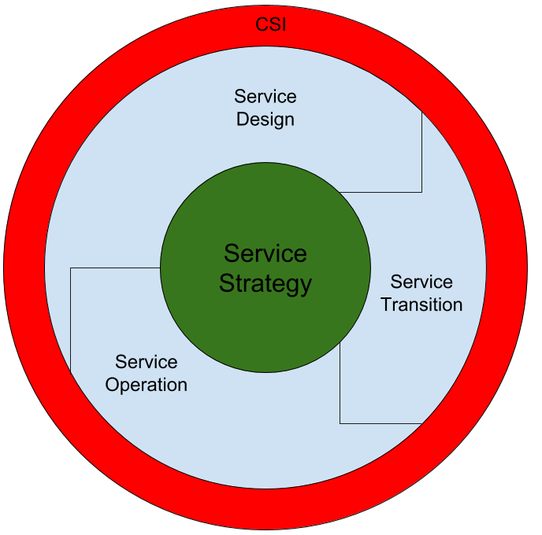

# ITIL

IT Infrastructure Library

ITIL stellt eine Prozesssammlung zur Orientierung dar und bildet den De-facto Standard für IT-Management.

ITIL funktioniert kundenorientiert, bei internen Projekten ist zu beachten, dass auch hier der Anwender der Kunde ist. Es gilt, die Anforderungen des Anwenders zu erfüllen. ITIL bietet sich hierfür als Grundlage an, da durch die Bewährung Fehler vermieden werden können. Außerdem stellt ITIL lediglich einen Orientierungsrahmen bereit, der Freiheiten offen lässt (*Good Practices*).

ITIL ist ein generisches Framework und stellt somit lediglich klar, was zu tun ist. Die Art (Wie) ist für den individuellen Anwendungsfall zu klären.

Stufe 1: Kernpublikationen
* Service Strategy
* Service Design
* Service Transition
* Service Operation
* Continual Service Improvement

Stufe 2: Complementary Guidance
* Diverse Zusatzliteratur mit Anpassungen für verschiedene Branchen.

Stufe 3: Web Supporting Services
* Online Verfügbare Templates, etc.

## Überblick

### Services

Sammlung physikalischer / logischer Bestandteile zur Unterstützung ausgewählter Geschäftsprozesse.

* Software
* Hardware
* ...

Anbieter von Services sind intern oder extern. Services sind nicht physikalischer Natur, sie erfordern Kommunikation zwischen Anwender und Personal.

Alle verfügbaren Services werden im Service Katalog gesammelt.

Differenzierung zwischen Produkten und Services. Bei einem Service bestehen zusätzliche Erwartungshaltungen, beispielsweise in Form von Zeit oder Qualität. Diese gilt es zu treffen, um Unzufriedenheit zu verhindern.

Services werden unterstützt durch sogenannte Service-Assets, das sind Fähigkeiten und Ressourcen, die bei der Erfüllung von Services benötigt werden. Mit den Fähigkeiten wird die effiziente und effektive Nutzung der Ressourcen gesichert.

Ressourcen sind Dinge wie *finanzielles Kapital*, *Infrastruktur*, *Applikationen* und *Informationen*, sowie *Mitarbeiter*. Ressourcen sind da oder nicht. Fähigkeiten (*Management*, *Organisation*, *Prozesse*, *Wissen*, *Mitarbeiter*) dagegen entwickeln sich.

### Service Management

Bereitstellung von Services zur Schaffung eines Mehrwerts für den Kunden.

### Prozesse

* Messbar
* Definierte Ziele
* Definierte Abnehmer
* Reaktion auf definierte Ereignisse
* Start & Ende
* Compliance (Einhaltung von Richtlinien)

Prozesse bestehen aus gesteuerten Aktivitäten zur Erzeugung eines Ergebnisses mit Kundennutzen.

Im Service-Lifecycle sind für jede Stufe verschiedene Prozesse vorhanden.

Beispiele:

* Service Strategy
  * Business Relationship Management
  * Service Portfolio Management
  * Demand Management
  * ...
* Service Design
  * Service Level Management
  * Supplier Management
  * Information Security Management
  * ...
* Service Transition
  * Transition Planning & Support
  * Change Management
  * Release & Deployment-Management
  * ...
* Service-Operation
  * Event-Management
  * Incident-Management
  * Problem-Management
  * ...

### Ziele

ITIL definiert *WAS* im IT-Management getan werden sollte, jedoch nicht spezifisch *WIE*. Hierdurch entstehen Möglichkeiten zur Nutzung eigener Produkte und der Anpassung an verschiedenste Tätigkeitsfelder. ITIL wird zur Unterstützung von Unternehmenszielen verwendet, beispielsweise die Folgenden:

* Verbesserung der Koordination
* Verbesserung der Qualität
* Reduktion von Störungen
* Kostensenkung
* Effizientere Prozesse

Zur Kontrolle der Zielerreichung definiert ITIL eine große Auswahl an Kennzahlen.

### IT-Service-Management

IT-Service-Management (ITSM) befasst sich mit der möglichst kundenfreundlichen und kostengünstigen Gestaltung (Planung, Steuerung, Überwachung) von IT-Dienstleistungen.  
Der Kunde steht im Vordergrund (Zwei Rollen: Vertragspartner und Anwender).

### ITIL Service-Lebenszyklus

Ziel des Service-Lebenszyklus ist die Beschreibung eines Services über dessen gesamte Lebensdauer (Strategie, Anforderungsaufnahme, Design, Umsetzung, Betrieb). Zentrales Element ist die Service-Strategy.

Der Lebenszyklus verdeutlicht das Zusammenspiel der verschiedenen Komponenten.
Beispielhafte Abbildung in *IT SERVICE MANAGEMENT MIT ITIL® V3 - Pocketguide* von *Christian Simons**

* Service Design: Bereitstellung
* Service Transition: Umsetzung, Übergang in Produktivbetrieb
* Service Operation: Produktivbetrieb
* Service Strategies: Governance, Verwaltung

Die Einführung von ITIL findet oft im Bereich *Operation* statt, da normalerweise eine IT-Abteilung bereits vorhanden ist.

#### Rollen im ITIL-Lebenszyklus

* Service Owner: Verantwortlicher (über den gesamten Lebenszyklus), Ansprechpartner für den Anwender
* Process Owner: Verantwortlicher für Steuerung und Überwachung, Dokumentation

## Governance-Prozesse

### CSI - Continual Service Improvement

Identifikation verbesserungsfähiger Elemente  
→ Muss messbar sein → Kennzahlen erforderlich

Differenzierung der Begriffe Effektivität / Effizienz:
* Effektiv: Korrekt anwendbar
* Effizient: kostengünstig / mit geringem Ressourcenaufwand realisierbar

Anwendung des *7-Step-Improvement-Prozesses* (iterativ):

* Entwicklung einer Verbesserungsstrategie
* Definition von Kennzahlen
* Erfassen der Kennzahlen
* Aufbereitung der Ergebnisse (Wo kann verbessert werden?)
* Analyse der Ergebnisse
* Präsentation der Ergebnisse und Schaffen von Verbesserungen
* Implementierung der Verbesserungen

### Service Strategy

* Anleitung zur Entwicklung und Umsetzung von Service Management zur Schaffung von Wettbewerbsvorteilen.

### Strategie-Management für IT-Services

* Aufbau und Implementierung von IT-Strategien
* Erfolgsmessung

### Service Portfolio Management

* Beschreibung von Services bezogen auf Kundennutzen
* Liefert Grundlage für Servicekatalog und beantwortet dem Anwender Fragen bzgl. Nutzen etc.

### Finanzmanagement für IT-Services

* Vorteile durch IT-Services finanziell quantifizieren

### Demand-Management

* Verständnis für Kundenbedarf im Detail
* Schaffung besserer, genauerer Anforderungen

### Business-Relationship-Management

* Beziehungspflege zwischen Kunden und Anbietern
* Konfliktlösung

## Operationale Prozesse

### Service Design

* Entwicklung einzelner Services (Neuentwicklung oder Update) mit dem Ziel zu effektiverer und effizienterer IT.
* Dokumentation mithilfe von *Service Level Requirements* (SLRs)

### Design Coordination

* Abstimmung einzelner Kriterien
* Integration von Qualitätskriterien

### Service-Level-Management

* Abstimmung mit Business-Relationship-Management (Wichtiger Bestandteil!)
* Definition aller Qualitätsmaßstäbe und Messkriterien
* Präzise Definition von SLAs

### Service-Level-Agreement (SLA)

* Vereinbarungen zwischen Anbietern und Kunden
* Enthält Informationen wie
  * Vertragspartner
  * Beschreibung
  * Verfügbarkeit
  * Support
  * Performance-Kennzahlen
  * etc.

### Service-Katalog-Management

* Katalog der verfügbaren Services, das Portfolio stellt eine Auswahl hiervon dar

### Kapazitätsmanagement

* Kontrolle der Erfüllung der SLA-Elemente

### Verfügbarkeitsmanagement

* Optimierung durch Überprüfung, Reporting, ...
* Schaffung von Systemen zum Verhindern von Störungen

### IT-Service-Kontinuitätsmanagement

* Schaffung von Systemen zur Behandlung von Störungen

### Sicherheitsmanagement

* Verhindern von Manipulation
* Mean Time To Repair (MTTR) = downtime
* Mean Time Between Failure (MTBF) = uptime

### Supplier-Management

* Steuerung von externen Lieferanten
* Prüfung möglicher neuer Lieferanten
* Verwaltung bestehender Lieferanten

## Service Transition

Beschaffung und Implementierung der IT.

### Transition Planning & Support

* Überführung von Services in den Produktivbetrieb
* Erkennung und Vermeidung von Risiken

### Change Management

* Kontrolle von Änderungen zur Gewährleistung der Dokumentation
* Änderungsanträge / Requests for Change (RFCs) genehmigen → Planung → Umsetzung → Überwachung

Bei der Definition des Testens neuer Elemente ist ITIL absichtlich schwammig definiert.

Elemente eines RFCs:
* WER hat den Antrag gestellt?
* WAS soll geändert werden (SLAs)?
* WARUM soll geändert werden?
* WANN soll die Änderung geschehen?

Änderungen werden vom Change Advisory Board geprüft.

### Bestands- und Konfigurationsmanagement

* Prüfungsprozess zum Abgleich der realen Welt in ITL.
* Verwaltung der einzelnen Komponenten in der Configuration Management Database (CMDB).
* Elemente hiervon werden Configuration Items (CIs) genannt.
* Den Kunden interessieren weniger die einzelnen CIs, als das Gesamtergebnis des Services, welche mit den vereinbarten SLAs übereinstimmen soll.

### Release and Deployment-Management

* Integration von Releases in die Zielumgebung unter Einhaltung von Zeitplänen.
* Testen, Planen und Vorbereitung des Produktiv-Einsatzes.

### Service Validating and Testing

* Qualitätssicherung

### Change Evaluation

* Prüfung von Erwartungshaltungen neuer Services
* Prüfung Kosten/Nutzen
* Entscheidungsbasis für Change Management

### Knowledge Management

* Bereitstellung von Informationen

## Service Operation

Sicherstellung von Effektivität und Effizienz bei Lieferung und Unterstützung von IT-Services.

### Event Management

* Automatisierte Überwachung von IT-Infrastruktur
* Abhängigkeiten sind zu beachten, beispielsweise Netzwerk → Software.

### Service Desk

* SPOC (Single Point of Communication) → Einheitliche Kommunikationsschnittstelle
* Beantwortung von Anwenderanfragen
* Übernimmt die Dokumentation der Aktivitäten
* Arbeit in verschiedenen Stufen (Level 1 / 2 / 3)

### Request Fulfillment

* Management von Anwenderanfragen / Beschwerden → Entlastung des Störungsmanagements

### Störungsmanagements

* Störung: Einfach behebbar
* Problem: Nicht einfach behebbar

* Priorisierung von Anfragen anhand der SLAs
* Unterteilung von Fehlern in bekannte Fehler (Known Error Database in der CMDB) und unbekannte Fehler (Probleme → Aufnahme des Problems)

### Problemmanagement

* Behandlung von Problemen und Fehlern
* Störungs- und Problemvermeidung

Änderungs- Störungs- und Problemmanagement spielen zusammen.

Workarounds: Einfach rücknehmbare Änderungen.

### Access Management

* Zugriffsrecht-Verwaltung
