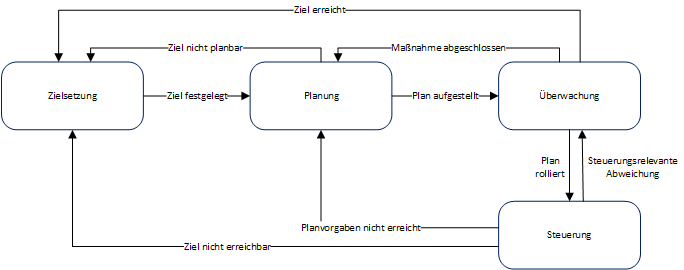
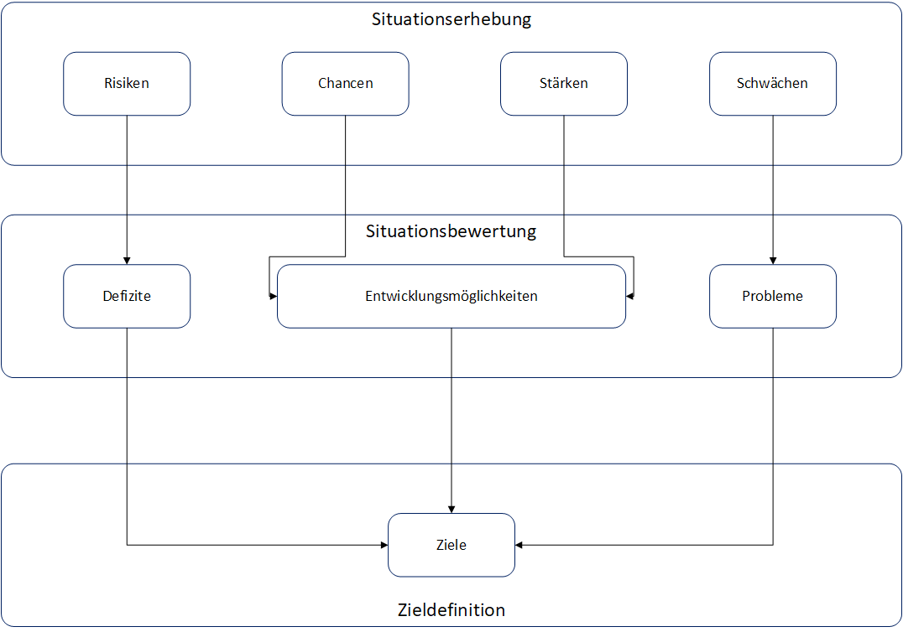

# IT-Controlling

Das IT-Controlling hat die Aufgabe

* Investitionen und laufende Ausgaben zu rechtfertigen
* Prüfung des effizienten IT-Einsatzes
* Steuerung, Planung, Kontrolle der gesamten IT im Unternehmen
* Wirtschaftlich effiziente und effektive Gestaltung von Ressourcennutzung und IT-Infrastruktur
* Bereitstellung von Kennzahlen zur IT-Infrastruktur

Mit dem Ziel der Verbesserung der Leistungsprozesse.

Das Aufgabenspektrum im IT-Controlling ist somit sehr vielfältig und bedarf unter anderem
* der Bereitsstellung von Information über die IV-Kosten- und
Nutzenrechnung
* komplexer Koordinierungsaufgaben im IV-Bereich

Die Basis aller Entscheidungen sind Daten
* Quantitative, nicht monetäre Daten
* Quantitative, monetäre Daten
* Qualitative Daten

Reichweite:
* Strategisches IT-Controling: Frage nach Effektivität der IV
* Operatives IT-Controlling: Frage nach der Effizienz

## Regelkreis des Controllings

### Unterscheidung zwischen Soll- und Planzahlen

SOLL-Zahlen beziehen sich auf den aktuellen Zeitpunkt und sind mit IST-Zahlen vergleichbar. Planzahlen beziehen sich auf das Ende einer Phase und den somit zu erreichenden Wert.

## Zielfindung

Die Zielfindung beschreibt das systematische Erarbeiten von Zielen. Ein Ziel ist dabei ein gewünschtes Ergebnis, dass zu einem definierten Zeitpunkt
mit einer bestimmten Qualität erreicht werden soll.

Elemente des Zielfindungsprozesses:

* Situationserhebung
* Situationsbewertung
* Zielbildung
* Zielanalyse
* Zielbewertung
* Zielintegration

## Planung

Die Planung bezeichnet den systematischen Prozess des Erkennens und der mittelbaren Lösung von zukünftigen Problemen

Elemente des Planungsprozesses:

* Abgrenzung des Planungsinhalts
* Lösungssuche
* Lösungsanalyse
* Lösungsentscheidung
* Maßnahmenplan
* Aufstellen von Einzelplänen
* Koordinieren der Pläne

## Überwachung

* Vergleich zwischen SOLL- und IST-Werten
* Größen: Mengen, Termine, Qualitäten, monetäre Größen
* Abweichungen sind zu bewerten und Toleranzen sind zu kennen

Das Ziel der Überwachung ist das rechtzeitige Aufdecken von Fehlentwicklungen in den laufenden Prozessen

* Unterstützung durch Key Performance Indicator (KPI)
* Aufzeigen des Fortschritts bei der Erreichung wichtiger
Zielsetzungen

## Steuerung

Die Steuerung verfügt über Maßnahmen, um das Verhalten von Personen und Prozessen so zu lenken, dass das zuvor geplante Ziel erreicht wird.

Aktionen:
* Abweichungsanalyse zur Ermittlung von Ursachen
* Ursachenanalyse zur Ermittlung der Relevanz der Ursachen
* Vorgehensentscheidung bzgl. Regeln, Plananpassung, Zielanpassung
* Reaktionsdefinition
* Rollieren der Pläne

## Kennzahlensysteme

Kennzahlensysteme und Kennzahlen sind ein wichtiger Bestandteil im IT-Controling, da sie die Grundlage für SOLL-IST-Vergleiche darstellen.
Jede verwendete Kennzahl stellt einen Ausschnitt des aktuellen Zustands dar. Kennzahlensysteme fügen diese Ausschnitte zu einem Gesamtbild zusammen. Ein Beispiel für ein Kennzahlensystem ist der Return on Investment (ROI).

Nutzung von Kennzahlen zum

* Validieren
* Steuern
* Rechtfertigen
* Intervenieren

Kennzahlen werden unterteilt in die folgenden Gebiete:

* Technische Kennzahlen, wie die Auslastung oder Verfügbarkeit
* Prozesskennzahlen wie Durchlaufzeit und Fehlerquote, aber auch Aufwand und Ergebnisqualität
* IT-Servicekennzahlen wie Kundensicht und Providersicht

Zur Ermittlung von Kennzahlen wird zu Beginn aus einem **Kennzahlenpool** ein **Informationsbedarf** identifiziert, dieser wird priorisiert, um **Machbarkeit** zu ermitteln, und abschließend realisiert, um über **optimale Kennzahlen** zu verfügen. Das Kosten-Nutzen-Verhältnis steigt bei diesem Vorgang stetig.

Kriterien zur Auswahl von Kennzahlen sind beispielsweise:

* Zweckeignung
* Genauigkeit
* Aktualität
* Wirtschaftlichkeit
* Nachvollziehbarkeit
* Vergleichbarkeit

### Kennzahlensystem nach Baumöl / Reichmann

Übergeordnet: **Übergeordnete Kennzahlen**
* IT-Effizienz
  * IT-Nutzen / IT-Kosten
* Servicegrad der IT
  * Termingerecht ausgeführte Aufträge / Anzahl Aufträge
* Verfügbarkeit
  * effektive Verfügbarkeit / technisch mögliche Verfügbarkeit

Untergeordnet:

* Kennzahlen der technischen Infrastruktur
  * Leistungsgrad
    * IT-Nutzen / IT-Kosten der techn. Infrastruktur
  * Beschäftigungsgrad
    * Effektive Nutzung / geplante Verfügbarkeit in CPU-min pro Std.
  * Kapazitätsauslastung
    * Effektive Nutung / technisch mögliche Nutzung in CPU-min pro Std.
  * Ausfallzeiten
    * Reparaturbedingte Downtime / geplante Verfügbarkeit
  * Wartungskostenanteil
    * Wartungskosten / IT-Kosten
* Kennzahlen der Software- / Systemstruktur
  * Softwaretechnischer Leistungsgrad
    * Softwarenutzen / Softwarekosten
  * Systemintegrationsnutzen
    * Durchlaufzeit / Anzahl der Teilprozesse
  * Benutzerfreundlichkeit, Bearbeitungseffizienz
    * Eingabezeit / Gesamtbearbeitungszeit
  * Systembetreuungsgrad
    * Systembetreuungskosten / Wert des Programm-Portfolios
  * Rerun-Quote
    * Rerun-Zeit / Produktive Verarbeitungszeit
* Kennzahlen IT-Personal
  * Service-Leistungsgrad
    * Servicegrad der IT / benötigte Mitarbeiterstunden zur Erzielung des Servicegrads
  * IT-Mitarbeiteranteil
    * Anzahl IT-Mitarbeiter / Gesamtanzahl Mitarbeiter
  * IT-Mitarbeiterquote
    * Anzahl IT-Mitarbeiter / durchschnittliche Anzahl IT-Mitarbeiter in der Branche
  * IT-Ausbildungsaufwand
    * IT-Ausbildungskosten / Anzahl der IT-Mitarbeiter

## Wirtschaftlichkeitsbetrachtung für den IT-Absatz

* Verhältnis zwischen Nutzen und getätigtem Mitteleinsatz
* Wirtschaftlichkeit: Ertrag / Aufwand
* Wirtschaftlichkeit = Δ Ertrag / Δ Aufwand
* Strategien zur Steigerung der Wirtschaftlichkeit:
  * Kostensenkung bei gegebenen Kapazitäten
  * Leistungssteigerung bei veränderten Kapazitäten

## Probleme bei IT-Investitionsentscheidungen

* Maßgrößenproblematik
* Unsicherheit
* Zurechnungsproblematik (Kostenzuordnung)
* Inovationsproblematik (Rentabilität von Investitionen)
* Ganzheitlichkeitsproblematik
