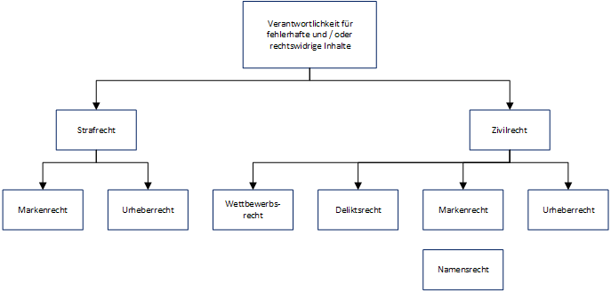

# Haftung

Besondere Haftungsregeln über Verantwortlichkeit der Diensteanbieter im Netz nach dem Telemediengesetz.

Unterscheidung Provider:

* Contentprovider §7 Abs. 1 TMG
  * Stellt eigene Inhalte zur Verfügung, Haftung nach allgemeinen Vorschriften.
* Host-Service-Provider §10 TMG
  * Unterhält Server, über den Kunden eigene Inhalte ins Internet stellen. Haftung, sofern konkrete Tatsachenkenntnis des Inhalts, technische Möglichkeit zur Nutzungsverhinderung und Zumutbarkeit.
* Access-Provider §8 Abs. 1 TMG
  * Vermittelt Nutzern Zugang zum Internet, keine Haftung für reine Vermittlung fremder Inhalte.

## Haftung von Beteiligten im Internet

Haftung für Handlungen Dritter?

Beispielsweise

* Anbieter von Warenauktionen für Markenrechtsverletzungen von Warenanbietern
* Forenbetreiber / Gästebücher / Kommentarfunktionen
* Inhalte auf verlinkten Websites

Nach BGH gelten die Vorschriften des TMG nicht für Unterlassungs- und Beseitigungsansprüche, jedoch für Geltendmachung von Schadensersatzansprüchen.

Anwendung der Grundsätze der (Dritt)Störerhaftung.

* Derjenige, der (ohne Täter zu sein) willentlich und zurechenbar zur Verletzung eines geschützten Rechtsguts beiträgt, kann als Störer für eine Schutzrechtsverletzung auf Beseiotugun / Unterlassung in Anspruch genommen werden.
* Haftung des Störers setzt Verletzung von Prüfpflichten voraus
* Umfang der Prüfpflichten bestimmt sich nach Zumutbarkeit im Einzelfall.

## Haftung für Links

Haftung besteht, wenn sich der Betreiber Inhalte *zu Eigen macht*, dies liegt vor, wenn der verlinkte Inhalt zur Vervollständigung dient, oder ein sog. Deep-Link gesetzt wird.

Haftung wegen Störerhaftung nur dann, wenn sogenannte *absolute Rechte* (Marken-, Patent- oder Urheberrechte) betroffen sind.

Haftung bei Verletzung wettbewerbsrechtlicher Verkehrspflichten

* Hyperlinks erhöhen die Gefahr der Verbreitung etwaiger rechtswidriger Inhalte
* Zur Haftungsvermeidung muss der Betreiber Prüfpflichten einhalten
  * Gesamtzusammenhang maßgeblich
  * Wenn Links lediglich den Zugang zu allgemein zugänglichen Quellen erleichtern, dürfen im Interesse der Meinungs- und Pressefreiheit keine strengen Anforderungen an Prüfpflichten gestellt werden.
* Haftung besteht ab Kenntnisnahme der Rechtsverletzung bei anschließender Untätigkeit.
* Disclaimer ".. ich übernehme keine Haftung.." wertlos

Umfang der Prüfpflichten am Beispiel Internetauktionsplattformbetreiber:

* Jedes Angebot auf mögliche Rechtsverletzungen zu prüfen ist nicht zumutbar
* Vorsorgemaßnahmen bei Kenntnisnahme, Einsatz von Software zum Finden von Verdachtsfällen

Umfang der Prüfpflichten am Beispiel Gästebuchbetreiber:

* Umfang Überwachungspflicht vor Kenntnis von Gerichten unterschiedlich beurteilt
* OLG Hamburg: Keine Vorabprüfung auf mögliche Rechtsverletzungen notwendig
* Aktionspflicht bei Kenntnisnahme konkreter Fälle

## Anschlussinhaber

Haftung des Anschlussinhabers im Falle von Urheberrechtsverletzungen:

* Familienmitglieder
  * Znfassende Prüfungspflichten inkl. stichprobenhafter Kontrollen (LG Hamburg)
  * Keine Dauerhafte Prüfung zumutbar (LG Mannheim)
  * Keine Haftung für Ehepartner (OLG Köln)
  * Keine Haftung für volljährige Familienmitglieder (BGH)
* Wohngemeinschaften und Nachbarschaft
  * Keine Haftung bei volljährigen Mitnutzern (LG Köln)
* Ungeschütztes privates WLAN
  * Störerhaftung annehmbar bei tatsächlichem Fremdzugriff, da Nutzung von technischen Schutzmaßnahmen unterlassen wurde
  * In der Praxis nur selten von Fremdzugriff auszugehen, nur bei konkreten Anhaltspunkten entsprechende Prüfung vorzunehmen

## Hotspots in Hotels, Internetcafes, Geschäften

Bisherige Rechtslage:

* Betreiber muss Sicherheitsmittel wie Portsperren einrichten (LG Hamburg)
* Betreiber muss Nutzer auf Rechtswidrigkeit von Filesharingsystemen hinweisen (LG Frankfurt)

Neue Rechtslage:

* Keine Störerhaftung mehr für Rechteverletzungen Dritter zu Lasten von Betreibern öffentlichen WLANs? Kein ausdrücklicher gesetzlicher Schutz
* Keine Störerhaftung mehr für gewerbliche Hotspot-Betreiber

## Erforderliche Hinweise auf externe Links

Die Weitervermittlung zu einem anderen Diensteanbieter ist dem Nutzer anzuzeigen.

Soweit Diensteanbieter ein Link auf ein Angebot Dritter setzt, hat er den Nutzer darauf hinzuweisen, dass er das ursprüngliche Informationsangebot verlässt und auf dasjenige eines Dritten weitergeleitet wird.

Grund: Für Nutzer kann es von Nachteil sein, wenn er nicht erkennen kann, wann er bestimmte Server bzw. Verantwortungsbereiche eines Dienstanbieters verlässt und mit Dritten in Kontakt tritt.

Praktische Umsetzung: Die Weiterleitung wird innerhalb eines kleinen Erläuterungstexts im Rahmen eines PopUps angezeigt, dort ist der Anbieter des vermittelten Angebots zu nennen und darauf hinzuweisen, dass es sich um einen externen Link handelt. Alternativ: PopUp bei Maus-Hover.

Unzureichend sind beispielsweise farbliche Hervorhebungen, Nichterkennbarkeit eines Verweises, oder pauschale Hinweise, dass das Angebot Verlinkungen zu Drittanbietern enthält.

## Pflicht zur Anbieterkennzeichnung

Art und WEise der Bereithaltung der Informationen auf Website gemäß §5 TMG:

* Leicht erkennbar
* Unmittelbar erreichbar (2 Klicks)
* Ständig verfügbar

Anbieterkennzeichnung nur für geschäftsmäßige Telemediendienste != rein privat betriebene Website.

Problem: kommerzielle aber unentgeltliche Leistungsangebote.

Rechtsfolge bei Verstoß gemäß §16 TMG:

* Risiko kostenpflichtiger Abmahnung durch Wettbewerber
* Ordnungswidrigkeit wenn vorsätzlich oder fahrlässig Information nicht richtig oder nicht vollständig verfügbar
* Geldbuße durch zuständige Behörde bis zu 50.000€

Benötigte Informationen:

* Name und Anschrift des Betreibers
* E-Mail-Adresse
* Angaben, die eine schnelle elektronische Kontaktaufnahme ermöglichen (einschließlich E-Mail)
* Angaben zur Zulassungsbehörde / Aufsichtsbehörde, soweit Tätigkeit der öffentlich-rechtlichen Zulassung bedarf
* Soweit vorhanden Handelsregisternummer
* Angabe der Kammer, der Website-Betreiber berufsrechtlich angehört
* Soweit vorhanden Umsatzsteueridentifikationsnummer
* Bei journalistisch-redaktionell gestalteten Angeboten Angaben zum Verantwortlichen für die jeweiligen Inhalte

## Besondere Pflichten bei kommerzieller Kommunikation

Neue Gesetze:

In sämtlichen Geschäftsbriefen jedweder Form (auch E-Mail) die im einzelnen im jeweils einschlägigen Gesetz angegebenen Mindesinformationen über den kaufmännischen Betrieb, u.a. insbesondere in der Regel aufführen:

* Das zuständige Registergericht
* Registernummer
* Gesellschaftsform
* Alle Vorstandsmitglieder / Geschäftsführer und Aufsichtratvorsitzender
* Mit Vor- und Nachnamen

Werbe- und Geschäftsmails müssen explizit gekennzeichnet werden.

## Weitere Informationspflichten aufgrund Verordnung über Informationspflichten für Dienstleistungserbringer

In Kraft getreten: Verordnung über Informationspflichten für Dienstleistungserbringer.  
Ergänzende Regelungen zu den sog. Impressumsangaben.  
Bußgelder und Abmahnungen bei nicht-beachten.  
Betroffen sind grundsätzlich alle Dienstleister, außer

* Finanzdienstleistungen
* Gesundheitsdienstleistungen
* Audiovisuelle Dienste
* Private Sicherheitsdienste
* Bereich der Steuern

Die DL-Verordnung unterscheidet zwischen Informationen, die proaktiv zur Verfügung gestellt werden müssen (a), und Informationen, die dem Kunden nur auf Nachfrage zur Verfügung gestellt werden müssen (b).

a: Informationen, die zur Verfügung gestellt werden müssen:

* Alle in §2 Abs. 1 DlInfoV aufgeführte Informationen
* Art der Bereitstellung:
  * Unaufgeforderte, direkte Mitteilung
  * Am Ort der Leistungserbringung / des Vertragsschlusses
  * Zugänglichmachung über elektronische Adresse
  * In den dem Kunden zur Verfügung gestellten Informationsunterlagen

b: Nur auf Nachfrage zur Verfügung zu stellende Informationen:

* Alle in §2 Abs. 2 DlInfoV aufgeführte Informationen
* Bereitstellung nur auf Nachfrage, aber in allen Informationsunterlagen über die Dienstleistung

Die Informationen müssen vor Abschluss eines schrifltichen Vertrages bzw. vor Erbringung der Diensleistung zur Verfügung gestellt werden.

## Anwendungsbereich Bundesdatenschutzgesetz

Das BDSG gilt neben den Bundesbehörden für alle nicht-öffentlichen Stellen.  
Hierunter fallen

* Juristische Personen
* Personengesellschaften
* Nicht rechtsfähige Vereinigungen
* Natürliche Personen

sofern personenbezogene Daten gunter Einsatz von Datenverarbeitungsanlagen erhoben, verarbeitet oder genutzt werden.
Das BDSG findet keine Anwendung bei ausschließlich persönlichen / familiären Zwecken.

Das BDSG ist aber nur ein Auffangnetz und tritt bei vorhandenen bereichsspezifischen Regelungen zurück, z.B. bei

* Telekommunikationsgesetz
* Telemediengesetz
* Datenschutzregelungen in vielen anderen Gesetzen und Verordnungen
* Landesdatenschutzgesetze fpr jeweilige Verwaltungen

## Grundstrukturen des BDSG

Geschützte Datenverarbeitsungsphasen:

* Erhebung von Daten
* Verarbeitung von Daten

Berechtigung zur Verarbeitung von Daten:

* Grundsätzlich ist jede Verarbeitung personenbezogener Daten verboten, es sei denn der Betroffene hat eingewilligt (im Regelfall ausdrücklich, in Ausnahmen stillschweigend oder mutmaßlich), ein Tarifvertrag oder eine Betriebsvereinbarung erlaubt die Verarbeitung, oder eine gesetzliche Vorschrift erlaubt die Verarbeitung.

## Folgen beim Verstoß

Die Datenverarbeitung ist unzulässig, Daten dürfen nicht mehr rechtmäßig verwendet werden. Der Betroffene kann sich gegen die verantwortliche Stelle zur Wehr setzen.

* Auskunftsrechte
* Beseitigungs- und Unterlassungsansprüche
* Schadensersatzansprüche

Die Datenschutzaufsichtsbehörde hat folgende Befugnisse:

* Vorgaben zum Datenschutz
* Prüfung des Unternehmens
* Verhängen von Geldbußen

Bei schweren Verstößen sind bis zu Gefängnisstrafen möglich.

## Rahmenbedingungen bei Social Media im Unternehmen

Xing, Twitter, Facebook, Blogs sind Telemediendienste gemäß TMG und bedürfen keiner Anmeldung.

Einzelne Beiträge können Urheberrechtlichen Schutz besitzen, sofern sie individuelle Schöpfungen aufweisen.
Dies kann gelten für Fotos, Filme, Texte, Beiträge, Grafiken, ...

Die Verwendung Urheberrechtlich geschützter Werke bedarf grundsätzlich der Zustimmung des Rechteinhabers.
Hierzu sind Verträge mit Agenturen / Fotografen / ... zu prüfen.

Rechte am eigenen Bild (des Abgebildeten):

* Grundsätzlich Einwilligung erforderlich
* Ausnahme: Bildnis aus dem Bereich öffentlicher Zeitgeschichte, Person als Beiwerk, öffentliches Versammlungsprivileg

Haftung für die Nutzung dieser Internet-Dienste

* Uneingeschränkte Haftung bei eigenen Beiträgen für beispielsweise Urheberrechtsverletzungen oder Verletzung des allgemeinen Persönlichkeitsrechts
* Bei fremden Inhalten grundsätzlich keine Haftung, evtl. Störerhaftung, wenn zumutbare Prüfpflichten verletzt werden

Anbieter haben Kennzeichnungspflicht bei geschäftsmäßigen Telemedien.
Bereits jedes nachhaltige, d.h. dauerhaft erreichbare (auch wenn unentgeltlich) Angebot ist als geschäftsmäßig zu beurteilen.  
Die Kennzeichnungspflicht besteht allerdings nur für Diensteanbieter, nicht für die Nutzer.
Das Impressum muss mit maximal zwei Klicks erreichbar sein, von jeder Unterseite aus.
Bei Verstoß auch hier kostenpflichtige Abmahnung durch Wettbewerber möglich.

Bei Verwendung fremder Kennzeichen / Marken oder fremder Namen besteht das Risiko der Namens- oder Markenrechtsverletzung.

Beachtung der allgemeinen Persönlichkeitsrechte / Äußerungsrechts: Tatsachenbehauptung != Meinungsäußerung

Werbliche Kommunikation auf elektronischem Wege, z.B. über Facebook ist zulässig, wenn der Empfänger dieser zustimmt (Beweislast auf Seiten des Werbenden),
oder (kumulativ zu erfüllen):

* Die elektronische Post-Adresse im Zusammenhang mit dem Verkauf einer Ware / Dienstleistung erhalten wurde
* Die elektronische Post-Adresse zur Direktwerbung für eigene ähnliche Waren und Dienstleistung verwendet wird
* Der Empfänger diesem nicht widersprochen hat
* Ein deutlicher Hinweis auf das Widerrufsrecht bei Erhebung und jeder Verwendung der Adresse angebracht ist

Datenschutzrelevante Funktionalitäten in Social Networks:

*Like*-Button von Facebook

* Anpassung der Datenschutzerklärung erforderlich
* Einbinden des Buttons ohne Aufklärung der Übermittlung der IP des Nutzers stellt unlautere geschäftliche Handlung und somit einen Wettbewerbsverstoß dar

Lösungsmöglichkeiten:

* 2 Klick-Methode
* Shariff-Button (Heise Online, verfügbar auf GitHub)

## Konsequenzen bei Nichtbeachtung:

Kostenpflichtige Abmahnung von Rechteinhaber oder Wettbewerbern wegen

* Gesetzeswidrigen Handelns durch Mitarbeiter auf Anweidung des Arbeitgebers
* Verantwortlichkeit des Arbeitgebers für Handlungen des Arbeitnehmers (Mitstörerhaftung)
* Abmahnungen durch Dritte wegen Verwendung des Like-Buttons ohne Information über Datenerhebung

Bußgeld aufgrund unvollständigem / fehlenden Impressum.

Strafanzeige bei Urheberrechtsverletzungen oder bei erheblichem Verstoß gegen Datenschutzvorschriften.

Risiko Löschung der Seite / Konto / Account bei Social Media Plattform bei Verstoß gegen Pflichten in deren Nutzungsbedingungen.

## Fazit

Bei Geschäftsleitung und Mitarbeitern muss ein gewisses Problembewusstsein geweckt werden.

Checkliste für Werbung in Social Networks:

* Nutzungsbedingungen prüfen unnd beachten
* Spezielle Angebote für Unternehmen beachten
* Datenschutzrechtliche Anforderungen beachten
  * Validität der Daten hinterfragen und prüfen
  * Datenschutzrechtliche Zulässigkeit des Like-Buttons bei Facebook prüfen, Datenschutzerklärung ergänzen

Kommerzielle Direktkommunikation muss entsprechend gekennzeichnet werden.

* Trennung zwischen redaktionellen Inhalten und Werbung
* Empfehlungsmarketing zwischen Unternehmen
* Produkt- und Dienstleistungsbewertungen aus dem eigenen Unternehmen
* Prominente als Eye-Catcher

Erstellung von Social Media Guidelines

* Aufklärung der Mitarbeiter über Kommunikationsmöglichkeiten sowie rechtliche Risiken und Konsequenzen
* Hinweise auf (un)zulässige Informationen
  * z.B. Verrat von Betriebs- und Geschäftsgeheimnissen
  * Verbreitung unternehmensschädlicher Äußerungen
* Aufbau von Kundendatenbanken, deren Herausgabe / Zuordnung bei Beendigung des Arbeitsverhältnisses streitig sein kann
* Hinweise auf Art und Umfang des erwünschten Einsatzes von Social Media
  * Nutzung während der Arbeitszeit
  * Welche Plattformen
  * Zeitliche Einschränkungen

Die Guidelines sind mit eventuell bereits bestehenden Vorgaben abzugleichen, um mögliche Kollisionen zu verhindern.

Wichtige Bereiche:

* Eigenverantwortung der Mitarbeiter
* Hinweise zum allg. Kommunikationsverhalten
* Vorsicht bei vertraulichen Informationen
* Respekt vor Wettbewerbern
* Einhaltung des Urheberrechts
* Benennung eines sachkundigen Ansprechpartners bei Unsicherheiten
* Bei Identifikation als Mitarbeiter Kennzeichnung als eigene Meinung
* Sicherheitsaspekte
* Kein Spamming
* Handhabung von Kundendaten
* Trennung private / geschäftliche Nutzung
* Darstellung möglicher Rechtsfolgen
* Hinweise auf rechtliche Verbindlichkeit der Regelungen

## Internet- und E-Mail-Nutzung am Arbeitsplatz

Private Nutzung kann gestattet werden durch

* Ausdrückliche vertragliche Regelung
* Betriebsvereinbarung (erfordert Betriebsrat)
* Ausdrückliche oder konkludente einfache Erlaubnis
* Entstehen betrieblicher Übung (mehrjährige unbeanstandete Übung erforderlich)

Wenn keine ausdrückliche Erlaubnis vorliegt, kann der AN nicht davon ausgehen, dass private Nutzung erlaubt ist.
Wenn allgemeine Erlaubnis vorliegt, muss der AN davon ausgehen, dass sich diese nur auf Pausenzeiten bezieht.

Die private Nutzung ohne Erlaubnis stellt eine Verletzung der Hauptleistungspflicht dar und ist ein Kündigungsgrund,
die Pflichtverletzun wird daran gemessen, wie sehr der AN seine Arbeit inhaltlich und zeitlich vernachlässigt.

Bei Überwachungsrechten des AG ist zu differenzieren zwischen

* Internet und E-Mail-Nutzung
* Gestatteter und nicht gestatteter Nutzung

Nicht als privat zu erkennende E-Mails dürfen vom AG eingesehen werden, da er berechtigterweise von geschäftlicher Nutzung ausgehen kann
Sollte die Mail dann als privat erkannt werden, ist sie sofort ohne Kenntnis vom Inhalt zu schließen

Bei nicht gestatteter Nutzung durch den AN:

* Abmahnung wegen Pflichtverletzung
* In gravierenden Fällen außerordentliche, in Wiederholungsfällen ordentliche Kündigung

Überwachungsrechte des AG bei Internetnutzung am Arbeitsplatz

* Systematisches Ausspähen der Mitarbeiter nicht erlaubt
* Unterbindung übermäßiger Überwachung durch allgemeines Persönlichkeitsrecht

Rechte des AG:

* Auswertung des Browserverlaufs ohne Zustimmung des AN zulässig, sofern Hinweise auf erhebliche unerlaubte private Nutzung bestehen
* Stichproben erlaubt, bedürfen allerdings Rechtfertigung
* Speicherung von Internetverbindungsdaten ist legitim
* Telekommunikationsgeheimnis gilt nicht für Surfen, Erlaubnis privater Nutzung wirkt sich nicht auf Kontrollbefugnis aus

## Der AG als Diensteanbieter

Wenn der AG die private Nutzung erlaubt, so wird er von vielen Gerichten als Diensteanbieter im Sinne des Telekommunikationsgesetzes §§3 Nr. 5, 85 angesehen.

* AG ist zur Wahrung des Fernmeldegeheimnisses angewiesen
* AG darf grundsätzlich weder Inhalte, noch Verbindungsdaten überwachen
* AG muss Erhebung personenbezogener Daten auf ein Minimum reduzieren, erhobene Daten direkt nach Nutzung löschen
* Wenn keine Trennung zwischen privater und geschäftlicher Nutzung (logisch oder physisch) erfolgt, ist sämtliche Kommunikation als privat einzustufen

## Probleme für den Arbeitgeber

Der AG ist nach §257 I 2,IV HGB verpflichtet, geschäftsrelevante E-Mails sechs Jahre lang zu speichern.
Die Archivierung privater E-Mails ist ihm jedoch durch TKG untersagt.

Die Verwendung von Anti-Viren-Software und Spam-Filtern kann eine Verletzung des Fernmeldegeheimnisses darstellen,
da das Filtern von Mails den Tatbestand des Unterdrückens im Sinne §206 StGB erfüllt.

## Lösungsvorschläge

* Generelles Verbot privater E-Mail-Nutzung
  * Einfachste und sicherste Lösung
  * AG steht vor keinem der oben genannten Probleme
  * AG hat Recht zur stichprobenhaften Einsichtnahme
  * Möglicherweise dem Betriebsklima abträglich
* Einwilligung in Handhabung privater Mails als geschäftliche
  * Archivierung, Einsicht und Sicherheitsmaßnahmen sind problemlos möglich
  * AN, die nicht Einwilligen, erhalten keine Erlaubnis
  * Vorkehrung zum Verhindern betrieblicher Übungen notwendig
  * Nicht nur AN, sondern auch Kommunikationspartner werden durch Fernmeldegeheimnis geschützt. Ausreichen des Erklärung des AN nicht vollständig geklärt.
* Trennung von privaten und geschäftlichen E-Mail-Konten
  * Klare Trennung
  * Archivierung, Einsicht und Sicherheitsmaßnahmen sind problemlos möglich
* Anweisung zum Ablegen der Mails in getrennten Ordnern
  * AN bestimmt selbst, welche Mails offen gelegt werden
  * Archivierung, Einsicht und Sicherheitsmaßnahmen sind problemlos möglich
* Asymmetrische Verschlüsselungsverfahren
  * Privater und geschäftlicher E-Mail-Verkehr werden mit zwei unterschiedlichen Schlüsseln geschützt
  * Archivierung der Daten mangels Einsichtmöglichkeiten unproblematisch
