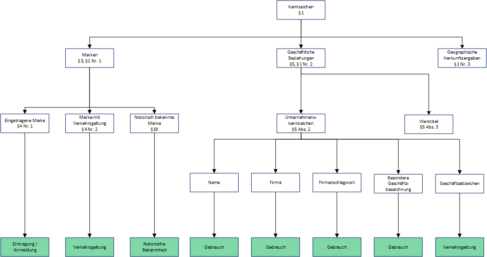

# Markenschutz

Sämtliche Paragraphen beziehen sich (sofern nicht anders gekennzeichnet) auf das [Markengesetz](https://www.gesetze-im-internet.de/markeng/).

Die grün dargestellten Knoten kennzeichnen den Schutzbeginn der Marke.

## Entstehung von Markenschutz

Eine Marke wird eingetragen bzw. ist verkehrsbekannt.

* im Geschäftlichen Verkehr, nicht privat.
* Die Eintragung ins Markenregister erfordert eine unterscheidungskräftige Marke, allgemeine Begriffe können nicht geschützt werden.
* Schutzfähigkeit allgemeiner Begriffe als Wort/Bildmarke fraglich.

Markenschutz kann auch ohne Eintragung entstehen, wenn durch die Nutzung eine Verkehrsgeltung innerhalb beteiligter Verkehrskreise von 30-50% erreicht wird.

Außerdem können Unternehmenskennzeichen, besondere Geschäftsbezeichnungen oder Werktitel, sowie Firmenschlagwörter geschützt werden.

Marken werden auf Wirkungsebenen verteilt, Nationale Marken, EU-Marken, IR-Marken (international).

## Voraussetzungen für einen markenrechtlichen Unterlassungsanspruch

### Marke muss (markenmäßig) benutzt werden

Eine Markenrechtsverletzung liegt vor, wenn die Marke als solche zur Unterscheidung von Waren und Dienstleistungen eines bestimmten Unternehmens, also als Marke, benutzt wird.

Anspruch liegt nicht vor, wenn die Marke lediglich genannt wird, beispielsweise als Suchbegriff im Internet. Bei Domains allerdings nach gängiger Rechtsprechung gegeben.

### Benutzung muss im geschäftlichen Verkehr erfolgen

  * Falls nicht, ist möglicherweise Anspruch nach Namensrecht möglich
  * Wenn eine Domain lediglich registriert ist, ebenfalls nur Namensrecht

Problem: Beispielsweise wird die intensive private eBay-Nutzung als Nutzung im geschäftlichen Verkehr angesehen.

### Verwechslungsgefahr

* Zeichenähnlichkeit / Zeichenidentität
* Branchennähe bzw. Waren- / Dienstleistungsnähe oder -identität

Je stärker die Kennzeichnungskraft einer Marke ist, desto größer ist ihr Schutzbereich.

### Priorität

Ältere Marke bevorzugt gegenüber jüngerer Marke

### Privilegierungstatbestände

gemäß §§ 23, 24

## Begrifflichkeiten

### Metatags

Für *normale* Besucher der Website unsichtbare Elemente im HTML-Code der Website, welcher die Indizierung durch Suchmaschinen beeinflussen kann.

Markenrechtsverletzungen durch Metatags sind möglich, da nicht die Sichtbarkeit entscheidend ist, sondern die Beeinflussung der Suchergebnisse.

Dies gilt auch für Keyword-Stuffing.

### Keyword-Stuffing

Unverhältnismäßig häufiges Wiederholen von Schlagworten, beispielsweise in HTML-Kommentaren, unsichtbaren Elementen oder Schriftfarben.

### Adwords

Text-Annoncen, die bei speziellen Schlagworten bei den Suchergebnissen aufgelistet werden.

Verwendung von fremden Marken als Adwords ist unter folgenden Bedingungen möglich:
* Deutliche Kennzeichnung des Ergebnisses als Anzeige, Abhebung von regulären Suchergebnissen
* Die Adword-Anzeige selbst darf die Marke nicht enthalten
* Die Domain des Werbenden muss unterhalb der Anzeige genannt werden
* Klare Abgrenzung zum Markeninhaber
* Keine Werbung für Waren / Diensleistungen unter fremdem Namen, sofern diese dadurch beeinträchtigt wird
* Wenn sich das buchende Unternehmen in Konkurrenz des Unternehmens befindet, sollte der Anzeigentext so formuliert werden, dass ein Hinweis darauf aufgenommen wird, dass keine Verbindung mit dem Markeninhaber besteht. Beispiel: "Kein Vertragspartner von XYZ".

### Keyword buying

Kauf von Listenplätzen bei Suchmaschinenanbietern für entsprechende Schlagworte.

## Voraussetzungen für einen Namensrechtlichen Unterlassungsanspruch gegenüber Domaininhaber

§12 BGB

* Privatperson / Hoheitsträger als Inhaber der Domain
* Firma mit Namensfunktion oder schlicht Name
* Unterscheidungskräftiger Name
* Namensmäßige Benutzung
* Interessenverletzung
  * Namensleugnung oder
  * Namensanmaßung durch Verletzung eines schutzwürdigen Interesses
* Priorität der Namensnutzung

Zur Beurteilung der Schutzwürdigkeit bedarf es der Abwägung mit dem Interesse des Domain-Inhabers an der Registrierung der Domain.

## Abwehr und Reaktion auf Schutzrechtsverletzungen

1. Festellung des Sachverhalts / Beweissicherung
2. Rechtsberatung
3. Dispute-Eintrag (.de)
4. Berechtigungsfrage oder Abmahnung
5. Einstweilige Verfügung / Klage / Schiedsverfahren
6. Strafverfahren

## Spezialfragen Domains

* Neue Domainendungen
  * Ende von Streitigkeiten? Bisher fraglich, da TLDs bisher nicht als unterscheidungskräftig beurteilt wurden.
* Umlautdomains
* Problem Domainpfändung
  * Verwendbares Vermögensrecht?
  * Wirtschaftlicher Wert?

## Checkliste zur Domainauswahl

* Vermeidung fremder Namen von Firmen, Privatpersonen, Prominenten, ...
* Keine geschützten Marken oder Bezeichnungen, die aufgrund von Verkehrsgeltung Markenschutz besitzen
* Vermeidung von Städte- oder Gemeindenamen sowie staatlicher Einrichtungen
* Keine *Tippfehler*-Domains
* Problem: Allgemeine Begriffe als Domainnamen sind möglich
* Problem: *Domainwahrheit* strittig, Verknüpfung des Namens auf Inhalte
